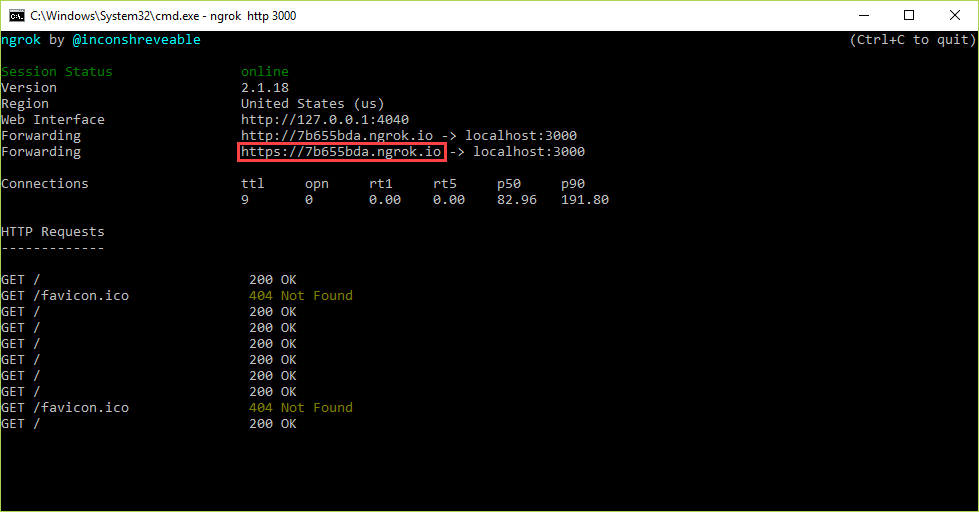
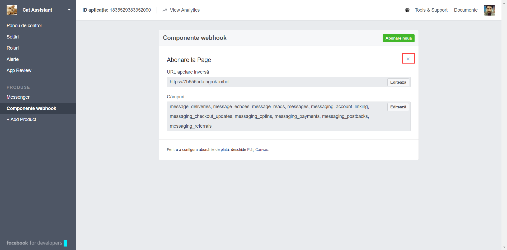
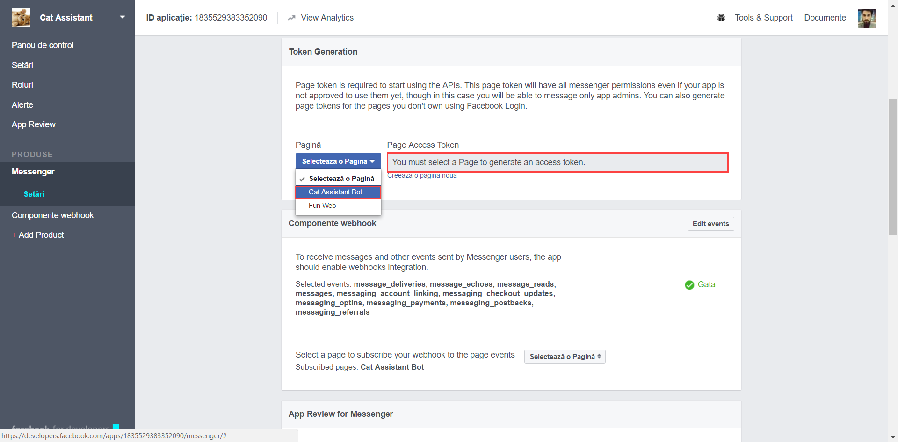
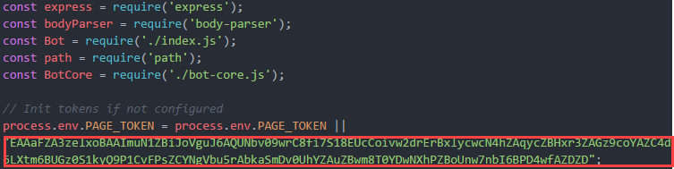
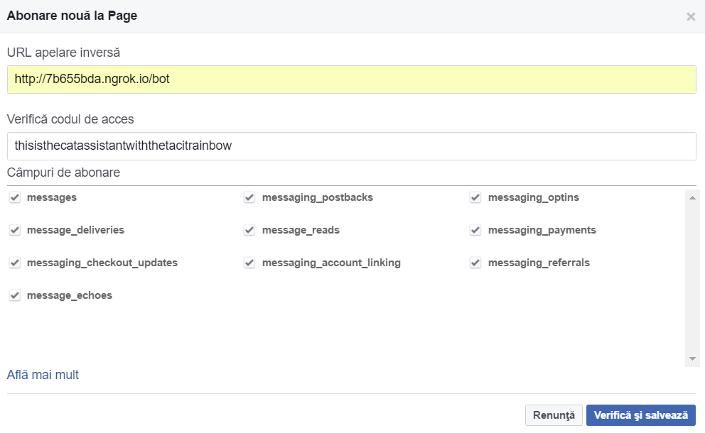

# Cat Assistant installation instructions

## Configure Facebook Messenger For localhost

1. Unzip _ngrok.zip_ to a local folder
2. run `ngrok http 3000 to start` a tunnel to the localhost
    + a window like in the image should appear. One needs to copy the highlightet link.

3. Go to [https://developers.facebook.com/apps/1835529383352090/webhooks/](https://developers.facebook.com/apps/1835529383352090/webhooks/) and delete the WebHook if exists (press X)

4. Go to [https://developers.facebook.com/apps/1835529383352090/messenger/](https://developers.facebook.com/apps/1835529383352090/messenger/)
    + On Token Generation, Select the Cat Assistant Key; eventually accept any requests for permissions. Then copy the page access token, as in the image

5. Go to [./app/bot.js](./app/bot.js) and assign to `process.env.PAGE_TOKEN` the token you just generated.
    + Don't forget to first unsubscribe the Cat Assistant Page and then subscribe it again after you change the server and add the Webhook.

5. In the `app` directory run `npm install` to install dependencies and `npm start` to start the server (make sure you have _Node v6.9.2 LTS_ installed)
6. Go again to [https://developers.facebook.com/apps/1835529383352090/messenger/](https://developers.facebook.com/apps/1835529383352090/messenger/) and on `Webhook Components`click _Setup Webhooks_. In the opened window, complete the _Callback URL_ with the `link/bot`, where link is the link highlighted in step 2 (make sure it's the **https** one). On access code complete with `thisisthecatassistantwiththetacitrainbow`. Then check all those checkboxes there.
    + **Obs:** Linking the bot to a specific localhost disables its access from other hosts (aka one can only have one server to run / test at a time)

### If everything went OK, the bot should be available now at your ngrok address.

## Configure Module Prerequisites
1. `pip install cherrypy`
2. `pip install aiml`
3. `python bot_response_api.py`

## Configure servers for startup
+ Run in the directory `module3/` the command `python module3.py`; it starts a server on [http://localhost:8090](http://localhost:8090)
+ configure _ngrok_ to tunnel this server (`ngrok http 8090`)
+ Run In the directory `module2/Bot/` the command `python bot_response_api.py`; it starts a server on [http://localhost:8099](http://localhost:8099)
+ configure _ngrok_ to tunnel this server (`ngrok http 8099`)
+ update the assistant's code with the addresses of the servers above-created