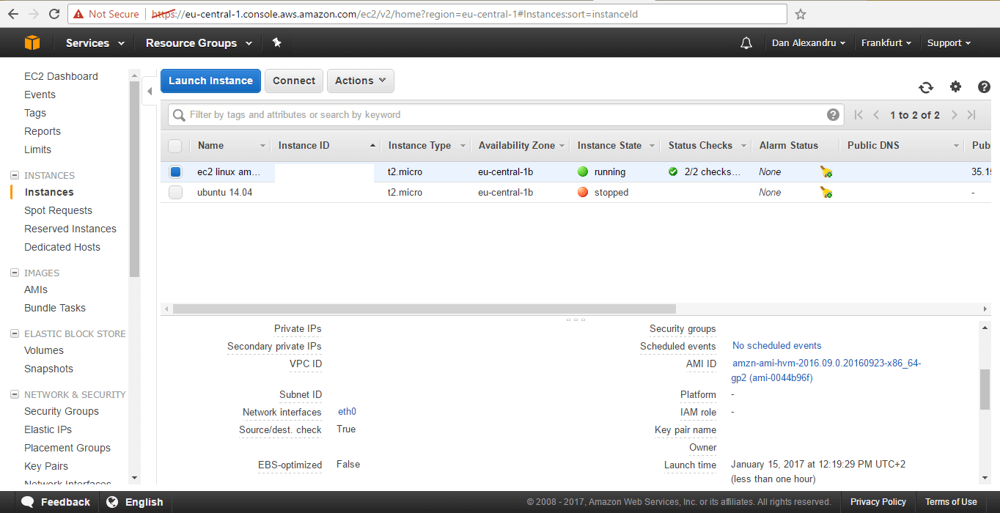
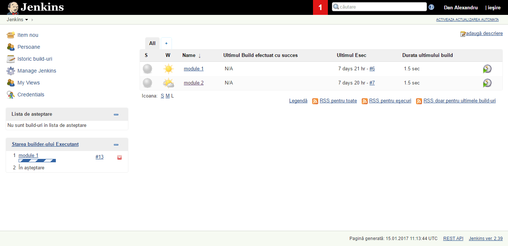
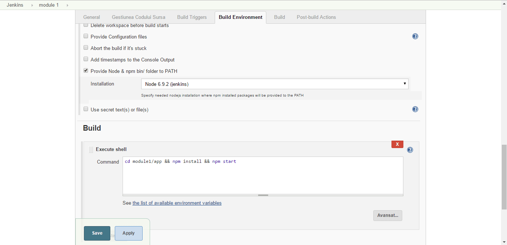
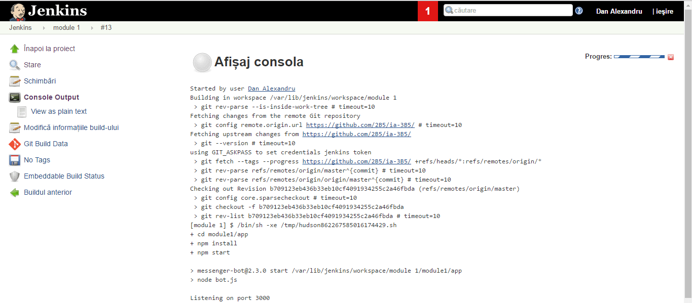

# ia-3B5
Artificial Intelligence project

## Deployment on AWS

> Screen 1 - AWS instance setup

I've deployed a `t2.micro` instance on AWS running `Amazon Linux AMI`, on which i made the following configurations:
- `sudo yum update`
- `sudo wget -0 /etc/yum.repos.d/jenkins.repo http://pkg.jenkins-ci.org/redhat/jenkins.repo`
- `sudo rpm --import http://pkg.jenkins-ci.org/redhat/jenkins-ci.org.key`
- `sudo yum install jenkins`
- `sudo service jekins start`

Additional notes:
- `vim /var/lib/jenkins/secrets/initialAdminPassword` - needed for initial login
- `/var/lib/jenkins/workspace` - needed to check task files (in some cases)

> Screen 2 - Interface of Jenkins CI with the tasks for the project

> Screen 3 - Configuring of the task for the server

> Screen 4 - Console output at task runtime

### Note

While a domain is pending for securing the app with an `ssl certificate` for `https`, this is a temporary workaround:
- `wget https://bin.equinox.io/c/4VmDzA7iaHb/ngrok-stable-linux-amd64.zip`
- `unzip ngrok-stable-linux-amd64.zip`
- `./ngrok http 3000` - blocking task
